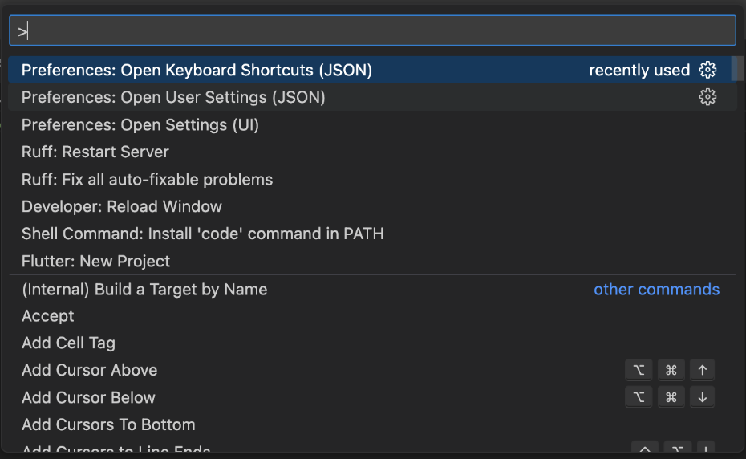

# duckdb

Em nossa rotina temos que trabalhar muitas vezes consumindo; arquivos csv, parquet e outros formatos, e muitas vezes essa atividade não é tão simples, estão muitas vezes na AWS, Azure, etc. 

O duckdb hoje é a forma mais eficiente para se trabalhar com:

- Múltiplos arquivos
- Quem é muito bom em SQL (compatibilidade de código)
- Quem gosta de Python, R ou Java
- Quem usa Pandas ou Polars
- Quem precisa de performance
- Quem quer aproveitar hardware local
- Utilizar um In process OLAP DBMS, Columnar database e com processamento vetorial 
  


**É o SQLite do Analytics**

[Como instalar o duckdb?](https://duckdb.org/docs/archive/0.9.1/installation/index?undefined=macos)

```bash
poetry add duckdb
```


## Como utilizá-lo com o vscode?

Acessar o `Open Keyboard Shortcuts (JSON)`



Incluir esse atalha, dessa forma sempre que selecionarmos determinado texto e apertarmos `shift+enter ` ele irá rodar esse código no terminal


Vamos brincar um pouco


- Fazer o Exercício 01

Vamos criar nossa primeira tabela /o/
Por ele rodar in-processo, ao sairmos do programa perdemos os dados

Exemplo: Persistindo os dados ao iniciar o CLI


Alguns pontos importantes sobre o formato duckdb

- 1 arquivo único (todas as tabelas ficam no mesmo arquivo)
  
- Suporta update
- Armazenada no formato colunar


